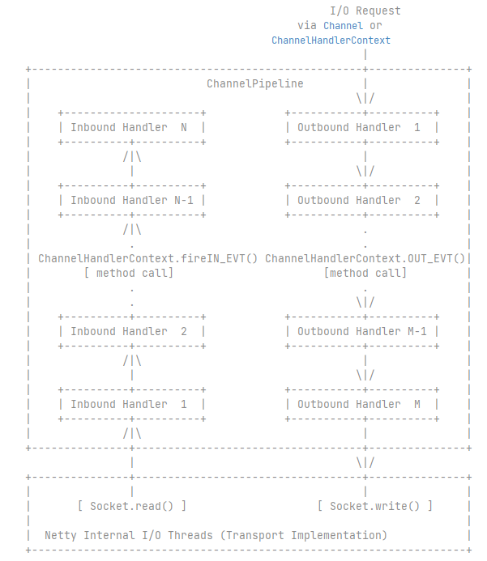

The following diagram describes how I/O events are processed by ChannelHandlers in a ChannelPipeline typically.



注意:
read操作的发起本身是out-bound事件,而read操作的完成则是个in-bound事件;同样地,write操作的发起本身是out-bound事件,而write操作的完成则是个in-bound事件;
还有类似的bind/connect/disconnnect/close这样的I/O操作,发起操作是out-bound事件而操作完成是in-bound事件.


## ChannelOutboundInvoker & ChannelInboundInvoker

ChannelInboundInvoker主要负责：通知in-bound事件,沿pipeline向后传播.
比如:
```text
ChannelInboundInvoker fireChannelRegistered();
ChannelInboundInvoker fireChannelActive();
ChannelInboundInvoker fireChannelRead(Object msg);
ChannelInboundInvoker fireExceptionCaught(Throwable cause);
```

ChannelOutboundInvoker 负责：发起(拦截/修改/执行)outbound I/O操作.
比如:
```text
ChannelFuture bind(SocketAddress localAddress);
ChannelFuture connect(SocketAddress remoteAddress);
ChannelFuture write(Object msg);
ChannelFuture flush();
ChannelFuture close();
ChannelFuture deregister();
```
ChannelOutboundInvoker/ChannelInboundInvoker为什么要拆成两个接口？ 这是典型的：Command/Event 分离设计.

```text
对比点	    ChannelInboundInvoker	    ChannelOutboundInvoker
作用	        触发 inbound 事件	        发起 outbound 操作
方法命名	    fireXxx	                    bind/write/close
传播方向	    向后	                        向前
是否产生IO	否	                        是
本质	        责任链传递	                I/O命令分发
```

```text
ChannelPipeline的真实结构本质上是一个：双向链表(doubly linked list)

                Inbound 方向 →
        ┌────────────────────────────────┐
        │                                │
   [HeadContext] <-> [Handler1] <-> [Handler2] <-> [Handler3] <-> [TailContext]
        │                                │
        └────────────────────────────────┘
                ← Outbound 方向
```

```text
HeadContext

pipeline 的起点
同时实现：ChannelInboundHandler/ChannelOutboundHandler
持有 Channel.Unsafe
真正执行底层 socket 操作

你可以理解为：Head = IO 入口

TailContext

pipeline 的终点
只实现 ChannelInboundHandler
作用：
    兜底未处理的 inbound 事件
    打印未处理异常

你可以理解为：Tail = 入站事件的最终收容所
---------------------------------------------------------------------------------------

以 channelRead() 为例：
Socket Read
     │
     ▼
 [HeadContext]
     │
     ▼
 [Handler1]
     │
     ▼
 [Handler2]
     │
     ▼
 [Handler3]
     │
     ▼
 [TailContext]
 
传播规则：
    从 Head 开始
    只经过实现了 ChannelInboundHandler 的节点
    使用 ctx.fireChannelRead() 向后传播

---------------------------------------------------------------------------------------

以 write() 为例
ctx.write(msg)   (假设在 Handler2 中调用)
       │
       ▼
   [Handler1]
       │
       ▼
   [HeadContext]
       │
       ▼
   unsafe.write(...)
       │
       ▼
   Socket Write
```

```text
Netty pipeline = 双向责任链 + 方向过滤机制

     +------------------+
     |  ChannelPipeline |
     +------------------+
          ▲        ▲
          │        │
inbound fire     outbound call


Head是I/O执行点;Tail是inbound终点;中间是可插拔的责任链.
```